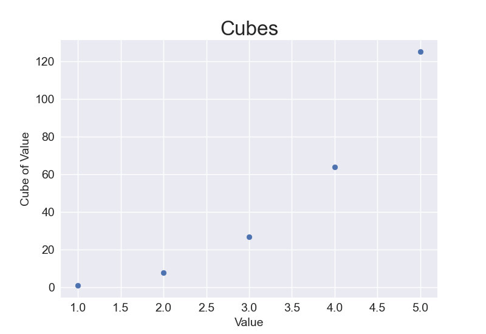
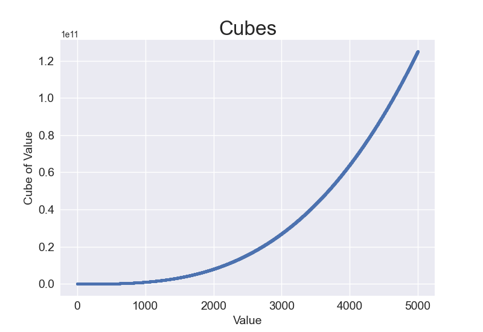
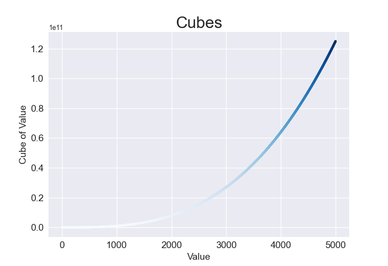

---
hide:
  - footer
title: "Solutions: Chapter 15"
---

# Solutions - Chapter 15

---

## 15-1: Cubes

A number raised to the third power is a *cube*. Plot the first five cubic numbers, and then plot the first 5,000 cubic numbers.

```python title="cubes.py"
import matplotlib.pyplot as plt

# Define data.
x_values = [1, 2, 3, 4, 5]
cubes = [1, 8, 27, 64, 125]

# Make plot.
plt.style.use('seaborn-v0_8')
fig, ax = plt.subplots()
ax.scatter(x_values, cubes, s=40)

# Set chart title and label axes.
ax.set_title("Cubes", fontsize=24)
ax.set_xlabel('Value', fontsize=14)
ax.set_ylabel('Cube of Value', fontsize=14)

# Set size of tick labels.
ax.tick_params(axis='both', labelsize=14)

# Show plot.
plt.show()
```

Output:



Plotting 5000 cubes:

```python
import matplotlib.pyplot as plt

# Define data.
x_values = range(1, 5001)
y_values = [x**3 for x in x_values]

# Make plot.
plt.style.use('seaborn-v0_8')
fig, ax = plt.subplots()
ax.scatter(x_values, y_values, c=y_values, cmap=plt.cm.Blues, s=10)

# Set chart title and label axes.
ax.set_title("Cubes", fontsize=24)
ax.set_xlabel('Value', fontsize=14)
ax.set_ylabel('Cube of Value', fontsize=14)

# Set size of tick labels.
ax.tick_params(axis='both', labelsize=14)

# Show plot.
plt.show()
```

Output:



## 15-2: Colored Cubes

Apply a colormap to your cubes plot.

```python
import matplotlib.pyplot as plt

# Define data.
x_values = range(1, 5001)
y_values = [x**3 for x in x_values]

# Make plot.
plt.style.use('seaborn-v0_8')
fig, ax = plt.subplots()
ax.scatter(x_values, y_values, c=y_values, cmap=plt.cm.Blues, s=10)

# Set chart title and label axes.
ax.set_title("Cubes", fontsize=24)
ax.set_xlabel('Value', fontsize=14)
ax.set_ylabel('Cube of Value', fontsize=14)

# Set size of tick labels.
ax.tick_params(axis='both', labelsize=14)

# Show plot.
plt.show()
```

Output:



## 15-3: Molecular Motion

Modify *rw_visual.py* by replacing `ax.scatter()` with `ax.plot()`. To simulate the path of a pollen grain on the surface of a drop of water, pass in the `rw.x_values` and `rw.y_values`, and include a `linewidth` argument. Use 5,000 instead of 50,000 points to keep the plot from being too busy.