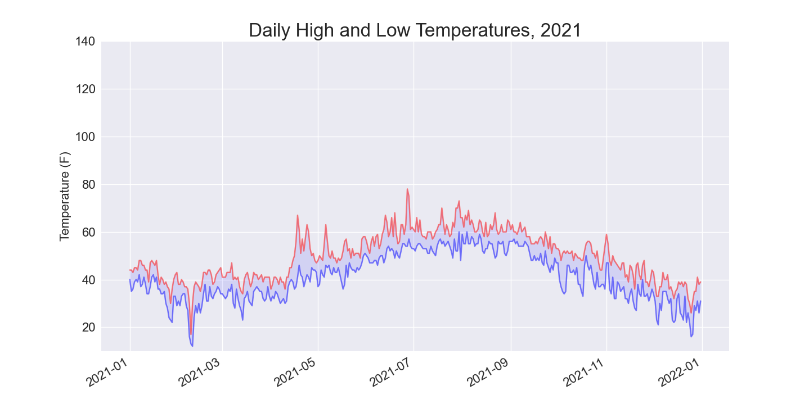
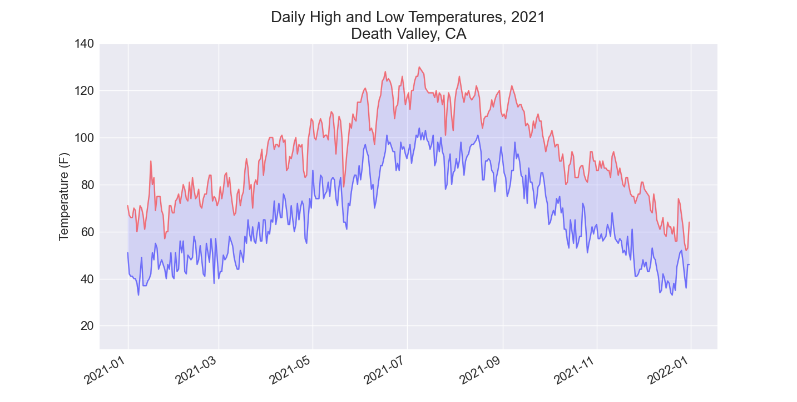

---
hide:
  - footer
title: "Solutions: Chapter 16"
---

# Solutions - Chapter 16

---

## 16-1: Sitka Rainfall

Sitka is located in a temperate rainforest, so it gets a fair amount of rainfall. In the data file *sitka_weather_2021_full.csv* is a header called `PRCP`, which represents daily rainfall amounts. Make a visualization focusing on the data in this column. You can repeat the exercise for Death Valley if you’re curious how little rainfall occurs in a desert.

```python title="sitka_rainfall.py"
from pathlib import Path
import csv
from datetime import datetime

import matplotlib.pyplot as plt


path = Path('weather_data/sitka_weather_2021_full.csv')
lines = path.read_text().splitlines()

reader = csv.reader(lines)
header_row = next(reader)

# Extract dates and rainfall amounts
dates, precips = [], []
for row in reader:
    current_date = datetime.strptime(row[2], '%Y-%m-%d')
    precip = float(row[5])
    dates.append(current_date)
    precips.append(precip)

# Plot the high temperatures.
plt.style.use('seaborn-v0_8')
fig, ax = plt.subplots()
ax.bar(dates, precips, color='blue')

# Format plot.
ax.set_title("Daily Precipitation, 2021", fontsize=24)
ax.set_xlabel('', fontsize=16)
fig.autofmt_xdate()
ax.set_ylabel("Precipitation Amount (in)", fontsize=16)
ax.tick_params(labelsize=16)

plt.show()
```

Output:


## 16-2: Sitka–Death Valley Comparison

The temperature scales on the Sitka and Death Valley graphs reflect the different data ranges. To accurately compare the temperature range in Sitka to that of Death Valley, you need identical scales on the y-axis. Change the settings for the y-axis on one or both of the charts in Figures 16-5 and 16-6. Then make a direct comparison between temperature ranges in Sitka and Death Valley (or any two places you want to compare).

The `set_ylim()` [method](https://matplotlib.org/stable/api/_as_gen/matplotlib.axes.Axes.set_ylim.html) allows you to set the limits of just the y-axis. If you ever need to specify the limits of the x-axis, there’s a corresponding `set_xlim()` function as well.

```python title="sitka_highs_lows_comparison.py"
from pathlib import Path
import csv
from datetime import datetime

import matplotlib.pyplot as plt


path = Path('weather_data/sitka_weather_2021_simple.csv')
lines = path.read_text().splitlines()

reader = csv.reader(lines)
header_row = next(reader)

# Extract dates, and high and low temperatures.
dates, highs, lows = [], [], []
for row in reader:
    current_date = datetime.strptime(row[2], '%Y-%m-%d')
    high = int(row[4])
    low = int(row[5])
    dates.append(current_date)
    highs.append(high)
    lows.append(low)

# Plot the high and low temperatures.
plt.style.use('seaborn-v0_8')
fig, ax = plt.subplots()
ax.plot(dates, highs, color='red', alpha=0.5)
ax.plot(dates, lows, color='blue', alpha=0.5)
ax.fill_between(dates, highs, lows, facecolor='blue', alpha=0.1)

# Format plot.
ax.set_title("Daily High and Low Temperatures, 2021", fontsize=24)
ax.set_xlabel('', fontsize=16)
fig.autofmt_xdate()
ax.set_ylabel("Temperature (F)", fontsize=16)
ax.tick_params(labelsize=16)
ax.set_ylim(10, 140)

plt.show()
```

Output:



Using the same limits for the `ylim()` method with the Death Valley data results in a chart that has the same scale:

