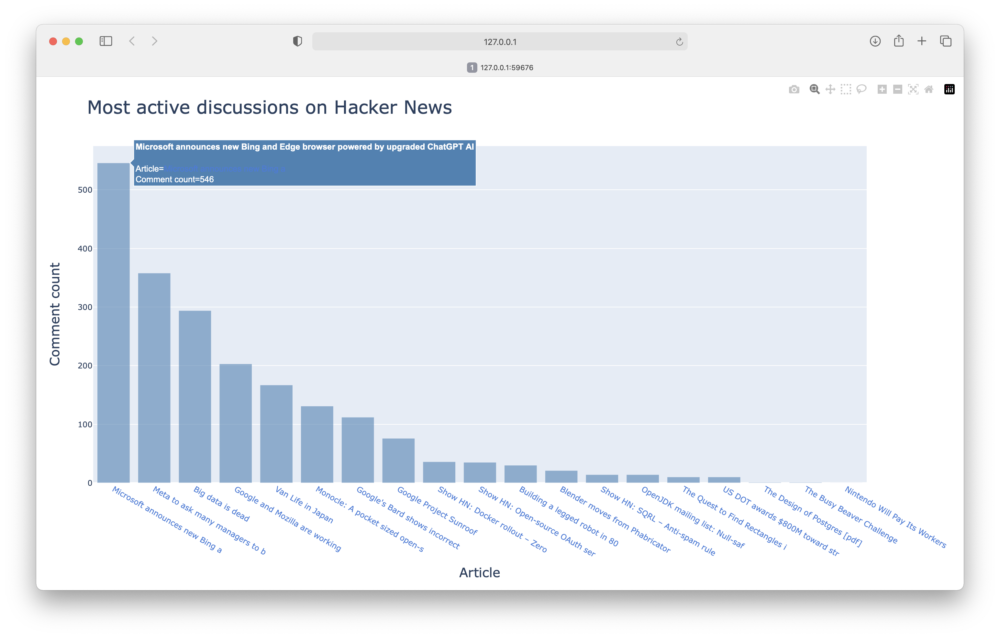

---
hide:
  - footer
title: "Solutions: Chapter 17"
---

# Solutions - Chapter 17

---

## 17-1: Other Languages

Modify the API call in *python_repos.py* so it generates a chart showing the most popular projects in other languages. Try languages such as *JavaScript*, *Ruby*, *C*, *Java*, *Perl*, *Haskell*, and *Go*.

```python title="javascript_repos.py"
import requests
import plotly.express as px


# Make an API call and check the response.
url = "https://api.github.com/search/repositories"
url += "?q=language:javascript+sort:stars+stars:>10000"

headers = {"Accept": "application/vnd.github.v3+json"}
r = requests.get(url, headers=headers)
print(f"Status code: {r.status_code}")

# Process overall results.
response_dict = r.json()
print(f"Complete results: {not response_dict['incomplete_results']}")

# Process repository information.
repo_dicts = response_dict['items']
repo_links, stars, hover_texts = [], [], []
for repo_dict in repo_dicts:
    # Turn repo names into active links.
    repo_name = repo_dict['name']
    repo_url = repo_dict['html_url']
    repo_link = f"<a href='{repo_url}'>{repo_name}</a>"
    repo_links.append(repo_link)

    stars.append(repo_dict['stargazers_count'])

    # Build hover texts.
    owner = repo_dict['owner']['login']
    description = repo_dict['description']
    hover_text = f"{owner}<br />{description}"
    hover_texts.append(hover_text)

# Make visualization.
title = "Most-Starred JavaScript Projects on GitHub"
labels = {'x': 'Repository', 'y': 'Stars'}
fig = px.bar(x=repo_links, y=stars, title=title, labels=labels,
        hover_name=hover_texts)

fig.update_layout(title_font_size=28, xaxis_title_font_size=20,
        yaxis_title_font_size=20)

fig.update_traces(marker_color='SteelBlue', marker_opacity=0.6)

fig.show()
```

Output:


## 17-2: Active Discussions

Using the data from *hn_submissions.py*, make a bar chart showing the most active discussions currently happening on Hacker News. The height of each bar should correspond to the number of comments each submission has. The label for each bar should include the submission’s title and act as a link to the discussion page for that submission. If you get a `KeyError` when creating a chart, use a try-except block to skip over the promotional posts.

```python title="hn_discussions_visual.py"
from operator import itemgetter

import requests
import plotly.express as px


# Make an API call and check the response.
url = 'https://hacker-news.firebaseio.com/v0/topstories.json'
r = requests.get(url)
print(f"Status code: {r.status_code}")

# Process information about each submission.
submission_ids = r.json()

submission_dicts = []
for submission_id in submission_ids[:20]:
    # Make a new API call for each submission.
    url = f"https://hacker-news.firebaseio.com/v0/item/{submission_id}.json"
    r = requests.get(url)
    print(f"id: {submission_id}\tstatus: {r.status_code}")
    response_dict = r.json()
    
    # Build a dictionary for each article.
    try:
        submission_dict = {
            'title': response_dict['title'],
            'hn_link': f"https://news.ycombinator.com/item?id={submission_id}",
            'comments': response_dict['descendants'],
        }
    except KeyError:
        # This is a special YC post with comments disabled.
        continue
    else:
        submission_dicts.append(submission_dict)

submission_dicts = sorted(submission_dicts, key=itemgetter('comments'),
                            reverse=True)

# Process data for plotting.
article_links, comment_counts, hover_texts = [], [], []
for submission_dict in submission_dicts:
    # Shorten long article titles.
    title = submission_dict['title'][:30]
    discussion_link = submission_dict['hn_link']
    article_link = f'<a href="{discussion_link}"">{title}</a>'
    comment_count = submission_dict['comments']

    article_links.append(article_link)
    comment_counts.append(comment_count)
    # Show the full title on hover.
    hover_texts.append(submission_dict['title'])

# Make visualization.
title = "Most active discussions on Hacker News"
labels = {'x': 'Article', 'y': 'Comment count'}
fig = px.bar(x=article_links, y=comment_counts, title=title, labels=labels,
        hover_name=hover_texts)

fig.update_layout(title_font_size=28, xaxis_title_font_size=20,
        yaxis_title_font_size=20)

fig.update_traces(marker_color='SteelBlue', marker_opacity=0.6)

fig.show()
```

Output:



## 17-3 Testing python_repos.py

In *python_repos.py*, we printed the value of `status_code` to make sure the API call was successful. Write a program called *test_python_repos.py* that uses `pytest` to assert that the value of `status_code`
is 200. Figure out some other assertions you can make: for example, that the number of items returned is expected and that the total number of repositories is greater than a certain amount.

```python title="test_python_repos.py"

```

Output:

```

```