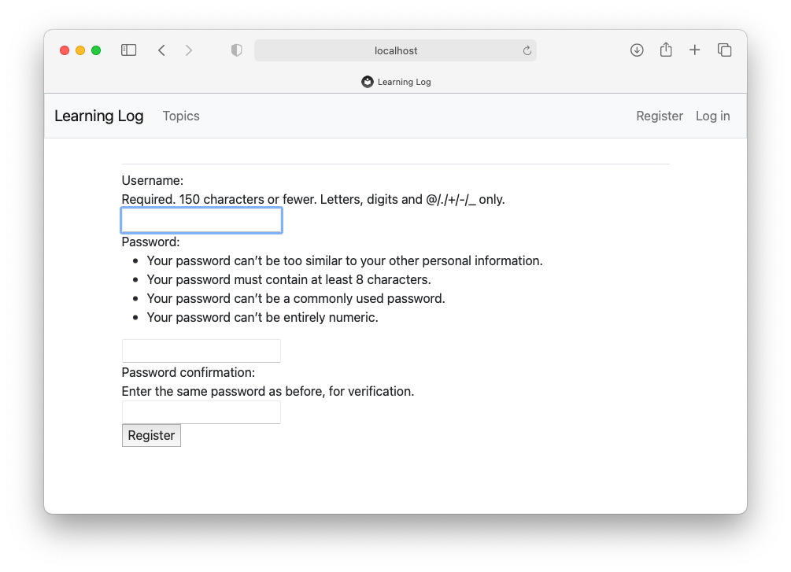
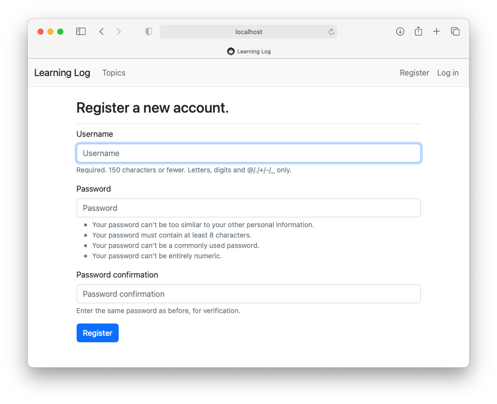
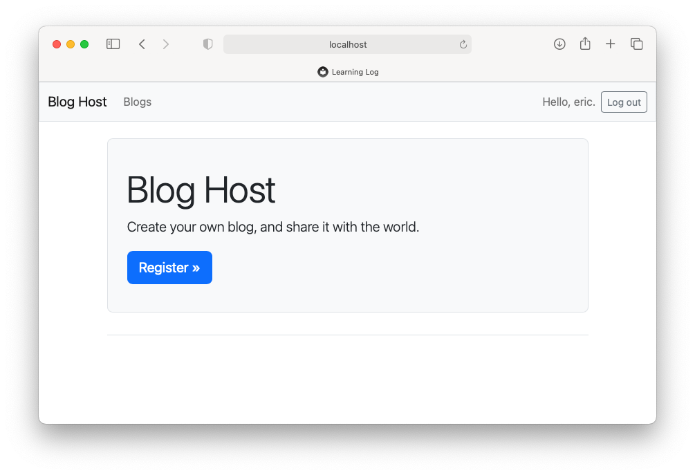

---
hide:
  - footer
title: "Solutions: Chapter 20"
---

# Solutions - Chapter 20

---

## 20-1: Other Forms

We applied Bootstrap’s styles to the login page. Make similar changes to the rest of the form-based pages, including `new_topic`, `new_entry`, `edit_entry`, and `register`.

*The full solution is [here](https://github.com/ehmatthes/pcc_3e/tree/main/solution_files/chapter_20/ex_20_1_other_forms). Here's the register page before styling, and after styling:*





## 20-2: Stylish Blog

Use Bootstrap to style the Blog project you created in Chapter 19.

*The full solution is [here](https://github.com/ehmatthes/pcc_3e/tree/main/solution_files/chapter_20/ex_20_2_stylish_blog). It may help to look at the Bootstrap documentation for styling [cards](https://getbootstrap.com/docs/5.2/components/card/) and [text](https://getbootstrap.com/docs/5.2/utilities/text/). Here's the home page, after applying styles similar to what Learning Log uses:*



## 20-3: Live Blog

Deploy the Blog project you’ve been working on to Platform.sh. Make sure you set `DEBUG` to `False`, so users don’t see the full Django error pages when something goes wrong.

***Note:** When you run `platform create`, make sure you use the name `blog_project` when you create the project, and in your settings files:*

```
(b_env)$ platform create
* Project title (--title)
Default: Untitled Project
> blog_project

* Region (--region)
The region where the project will be hosted
  [au.platform.sh  ] Sydney, Australia (AWS) [867 gC02eq/kWh]
  [au-2.platform.sh] Sydney, Australia (AZURE) [867 gC02eq/kWh]
  ...
> us-3.platform.sh

* Plan (--plan)
The subscription plan
Default: development
Enter a number to choose: 
  [0 ] development
  [1 ] standard
  ...
> 0

* Environments (--environments)
The number of environments
Default: 3
> 3

* Storage (--storage)
The amount of storage per environment, in GiB
Default: 5
> 5
```

*The full solution is [here](https://github.com/ehmatthes/pcc_3e/tree/main/solution_files/chapter_20/ex_20_3_live_blog).*

## 20-4: Extended Learning Log

Add one feature to Learning Log, and push the change to your live deployment. Try a simple change, such as writing more about the project on the home page. Then try adding a more advanced feature, such as giving users the option of making a topic public. This would require an attribute called `public` as part of the `Topic` model (this should be set to `False` by default) and a form element on the new_topic page that allows the user to change a topic from private to public. You’d then need to migrate the project and revise *views.py* so any topic that’s public is visible to unauthenticated users as well.

*The full solution for allowing users to make topics public is [here](https://github.com/ehmatthes/pcc_3e/tree/main/solution_files/chapter_20/ex_20_4_public_topics).*

